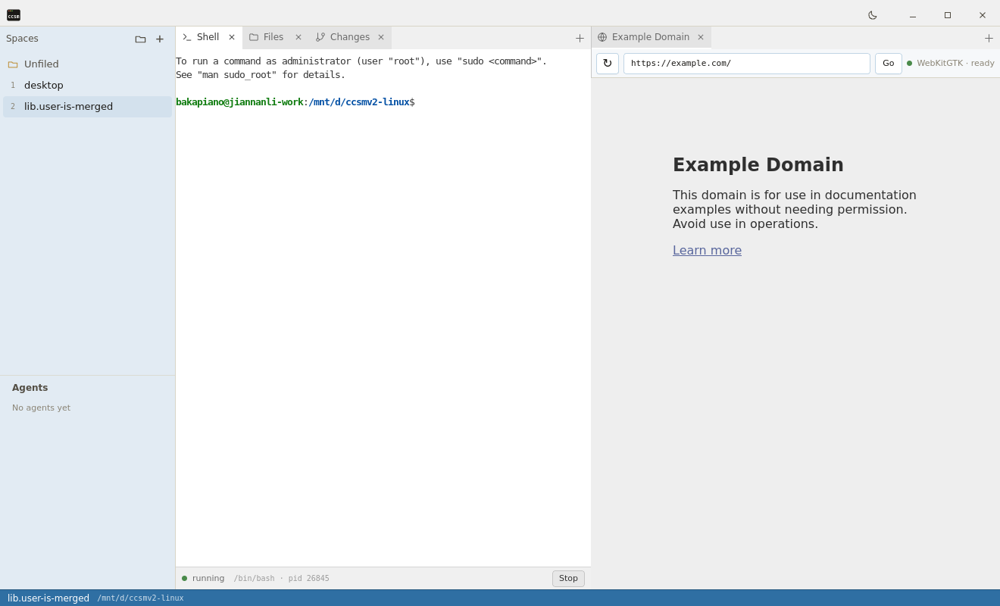
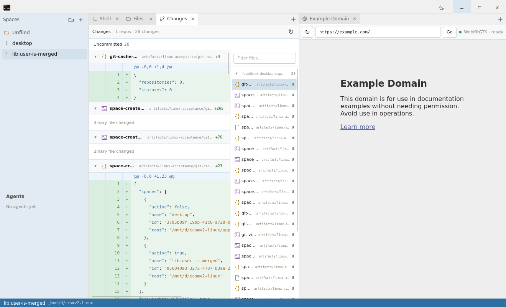

# WSLg merged-main acceptance evidence

This evidence was captured from application commit
`9c5e22fd3e89a74566feef0adca00d485adf3502` after merging `origin/main`.

## Result

- Platform: WSL 2.6.3.0 / Ubuntu 24.04.4 LTS / WSLg 1.0.71
- Renderer: Mesa `d3d12`, selected automatically after the WSLg prerequisites check
- Binary SHA-256: `70C43FA588AB4D62D7AA0B255956538BA253836895DFA95DAA4AED1B5B5F6657`
- Desktop E2E: 1 passing scenario in 16.1 seconds
- Space created: `lib.user-is-merged`
- Space flow: create, switch to the initial Space, and switch back all completed
- Hidden Changes cache: 0 repositories / 0 statuses
- Visible Changes cache: 1 repository / 1 status, `1 repos · 28 changes`
- Visible Git scan: 4.840 seconds
- Native child WebView: visible throughout the Space flow

The raw state snapshots, cache counts, step timestamps, renderer-only captures, and
composited desktop captures are in [`space-flow-merged`](space-flow-merged/).

## Screenshots

Space creation and native child WebView:

Changes panel after its first visible scan:

