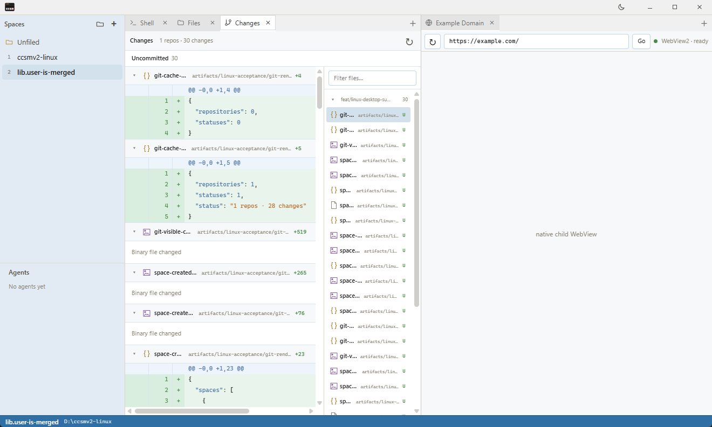
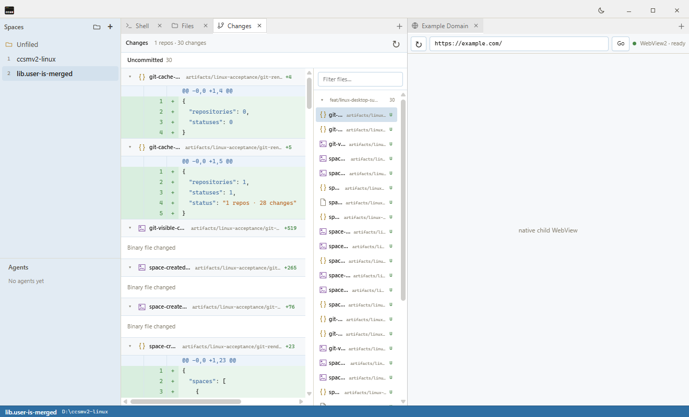

# Windows merged-main acceptance evidence

This evidence was captured from application commit
`9c5e22fd3e89a74566feef0adca00d485adf3502` after merging `origin/main`.

## Result

- Binary SHA-256: `EB858F30A78751EDAB7FDDA3C49BDD68887CD87BE5015137E881CB489E0AB5A2`
- Space created: `lib.user-is-merged` in 556 ms
- Space switches: 147 ms back to the initial Space, 133 ms back to the new Space
- Hidden Changes cache: 0 repositories / 0 statuses
- Visible Changes cache: 1 repository / 1 status, `1 repos · 30 changes`
- Visible Git scan: 299 ms
- Loaded diff text: 3,154 characters
- Loaded navigation text: 2,782 characters
- Browser console errors: 0
- Native child WebView: visible in the composited desktop capture

## Screenshots

Full desktop composition, including the native child WebView:

Renderer-only WebView capture:

