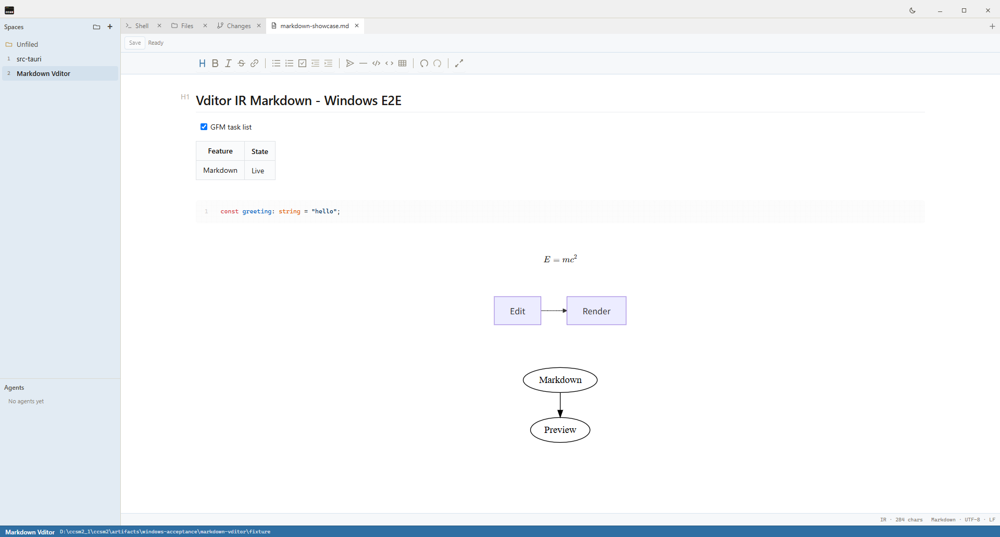

# Windows Vditor Markdown acceptance

The isolated Windows Tauri development app was exercised through WebView2 CDP with `playwright-cli 0.1.17`.

The flow created a Space for `fixture/`, opened `markdown-showcase.md` from Files, waited for every renderer, edited the H1 through the Vditor contenteditable surface, observed Dirty, and used undo to return to Clean. A second edit was saved immediately with `Ctrl+S`; the complete marker was then verified on disk. It also switched the application to dark mode and verified the Vditor dark class plus the local `github-dark` code theme.

Validated renderers:

- highlight.js with line numbers
- KaTeX
- Mermaid
- Graphviz

All Vditor scripts, styles, and fonts resolved from `/vendor/vditor`; the page contained no `unpkg.com` runtime resources.

The production build measured a 281.4 KiB Vditor entry chunk and 9.9 MiB of raw offline renderer assets across 35 files.

Machine-readable assertions are recorded in [result.json](result.json).
