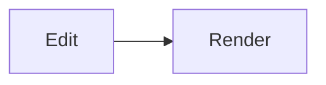
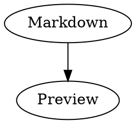

# Vditor IR Markdown

- [x] GFM task list

| Feature | State |
| --- | --- |
| Markdown | Live |

```typescript
const greeting: string = "hello";
```

$$E = mc^2$$


```mermaid
graph LR; Edit --> Render
```


```graphviz
digraph G { Markdown -> Preview }
```
